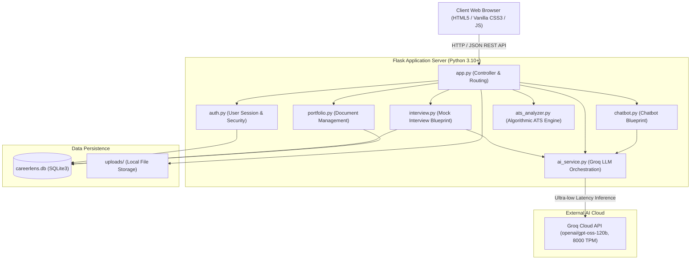
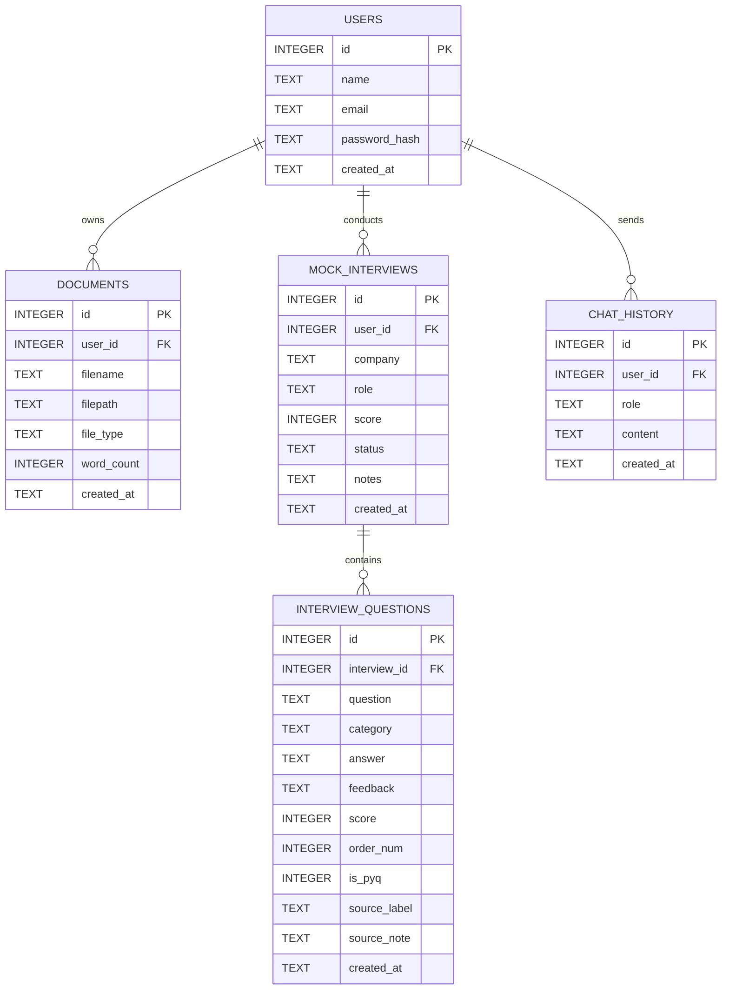

# 📄 CareerLens — Comprehensive Technical & Functional Report

---

## 1. Executive Summary

**CareerLens** is an intelligent, full-stack Career Intelligence and Mock Interview Platform. It is engineered to bridge the gap between job seekers and competitive industry hiring bars. Rather than relying on generic boilerplate templates or fabricated data, CareerLens uses modern Large Language Models (LLMs) via the **Groq API** (primarily leveraging `openai/gpt-oss-120b` and `openai/gpt-oss-20b`) combined with deterministic heuristics to provide:
1. **Target Role Alignment**: Real-world job matching backed by evidence-based rationales and company recommendations.
2. **Actionable Learning Roadmap**: Prioritized, chronological skill-gap bridging roadmaps with concrete portfolio artifacts.
3. **Company-Based Mock Interview Loop**: Role- and company-specific interview loops with honest distinction between authentic previous-year questions (PYQs) and AI-generated practice questions, accompanied by real-time answer critique and final debrief reports.
4. **ATS Resume Compatibility Engine**: Algorithmic scoring of resume structure, action verbs, and quantifiable achievements.
5. **AI Career Strategist**: Conversational advisor for career planning and interview guidance.

---

## 2. High-Level System Architecture

CareerLens follows a clean, modular MVC-style architecture with clear separation of concerns between web presentation, business logic, persistence, and AI orchestration.

---

## 3. Technology Stack & Key Libraries

| Layer | Technologies / Libraries | Purpose |
| :--- | :--- | :--- |
| **Frontend** | Semantic HTML5, Custom CSS3 Design System, Vanilla JavaScript (ES6+) | Highly responsive SPA layout, theme-consistent UI, real-time feedback rendering without heavyweight frameworks. |
| **Backend Framework** | Python 3.10+, Flask, Werkzeug | Lightweight, high-throughput REST API serving web pages and asynchronous JSON endpoints. |
| **AI / LLM Integration** | Groq API SDK (`groq`), Requests HTTP Fallback | Ultra-fast inference with fallback resilience. Default: `openai/gpt-oss-120b` (120B parameter model). |
| **PDF Extraction** | PyMuPDF (`fitz`) | High-fidelity text and layout extraction from candidate resume PDFs. |
| **Database** | SQLite3 (`sqlite3` standard library) | Zero-overhead local relational storage with automated schema migration. |
| **Security & Secrets** | `python-dotenv`, `werkzeug.security` (PBKDF2 SHA256) | Environment variable isolation, password hashing, and session authentication. |

---

## 4. Deep-Dive: Core Platform Features

### 4.1 Target Role Alignment
* **User Input**: Candidate uploads a PDF resume.
* **Extraction**: PyMuPDF extracts raw text into memory and caches it for the active session.
* **LLM Analysis**: 
  - System prompt enforces hiring manager personas.
  - LLM evaluates experience length, core tech stack, domain exposure, education, and past projects.
  - Determines match percentages against top modern tech roles (e.g., *Backend Software Engineer*, *Data Scientist*, *Full Stack Developer*, *DevOps/Cloud Architect*).
* **Evidence-Based Rationale**:
  - Instead of vague praise, provides concrete reasons (e.g., *"Demonstrated 3 years of building REST APIs in Django/FastAPI and high-throughput payment microservices"*).
* **Recommended Companies**:
  - Automatically identifies companies actively recruiting for that specific profile and scale (e.g., Amazon, Stripe, Google, Shopify).
* **Reliability Fallback**: If offline or API key absent, smoothly falls back to deterministic skill-overlap calculations from a curated role taxonomy.

### 4.2 Actionable Learning Roadmap
* **Problem Solved**: Most online roadmaps are static checklists that ignore what the candidate already knows.
* **Dynamic Customization**:
  - Takes candidate's current verified strengths into account so they never waste time on basics.
  - Analyzes the missing skills against modern production environments (e.g., asynchronous event loops, CI/CD pipelines, container orchestration, automated testing).
* **Chronological Milestones**:
  - Organizes steps into prioritized phases (e.g., *Week 1-2*, *Week 3-4*, *Week 5-6*).
  - Explains the specific sequencing logic (why step A precedes step B).
* **Portfolio-Ready Engineering Artifacts**:
  - Assigns a concrete capstone or repository artifact to each phase (e.g., *"Refactor payment microservice to include 100% test coverage using PyTest, mock database calls, and automate GitHub Actions workflows"*).

### 4.3 Company-Based Mock Interview Loop
* **Setup**: Candidate selects target company (e.g., *Google*, *Amazon*, *Microsoft*, *Meta*), target role, and question count.
* **Genuine PYQ vs. AI Practice Distinction**:
  - **Authentic PYQs**: The LLM queries verified public interview question reports (e.g., LeetCode company-tagged questions, Glassdoor interview debriefs). These are tagged with `is_pyq=1`, `source_label="Real Reported Question (PYQ)"`, and note context.
  - **AI Practice Questions**: Where authentic reported questions are unavailable, the LLM crafts targeted drills tailored to the company's culture and architectural scale, tagged with `is_pyq=0`, `source_label="AI-Generated Practice Question"`.
  - **Zero Fabrication**: Prompts strictly prohibit generating artificial questions and falsely labeling them as PYQs.
* **Real-Time Answer Evaluation**:
  - When candidate submits an answer, Groq LLM evaluates:
    1. **Mistakes / Inaccuracies**: Pinpoints conceptual errors, oversimplifications, or incorrect terminology.
    2. **Missing Points**: Lists key production considerations, complexities, or edge cases omitted.
    3. **Model / Improved Answer**: Generates a senior-level reference answer with production code examples and best practices.
    4. **Score & Verdict**: Calibrates answer quality on a 1-10 scale.
* **End-of-Session Executive Report Card**:
  - Aggregates overall performance into a 0-100 score.
  - Assigns a definitive verdict (*Strong Hire*, *Hire*, *Lean Hire*, *Needs More Prep*).
  - Outlines candidate strengths, critical improvement areas, and tailored interview tips for that target company.

### 4.4 Algorithmic ATS Analyzer
* **Scoring Dimensions**:
  - **Section Completeness**: Checks presence of Experience, Education, Skills, and Projects.
  - **Action Verb Density**: Evaluates leadership and achievement verbs (e.g., *architected*, *engineered*, *spearheaded*).
  - **Metric Quantification**: Detects percentages, dollar amounts, performance speeds, and scale metrics (`X%`, `$Y`, `ms`, `QPS`).
  - **Readability & Formatting**: Word counts, bullet-point structure, and formatting hygiene.

### 4.5 AI Career Strategist Chatbot
* Multi-turn conversational interface backed by Groq LLM.
* Context-aware memory tracking recent conversation turns.
* Specialized in resume critique, behavioral interview strategies (STAR method), and career guidance.

---

## 5. Database Schema & Persistence

CareerLens uses an embedded SQLite database (`careerlens.db`) with automatic table creation and seamless schema migrations in `database.py`.

### Schema ER Diagram

---

## 6. AI Engine & Groq Optimization Highlights

### Why Groq & Model Selection
1. **Low-Latency Generation**: Groq LPU inference provides near-instantaneous token generation, making per-question mock interview evaluations feel interactive.
2. **Model Choice**:
   - Primary: **`openai/gpt-oss-120b`** (120-billion parameter model) offering 8,000 output tokens per minute on the on-demand tier.
   - Backup / Fallback 1: **`openai/gpt-oss-20b`** (fast, structured JSON support).
   - Backup / Fallback 2: **`qwen/qwen3.8-27b`**.
3. **Resilience & Token Throttling**:
   - `_call_groq()` enforces `effective_max_tokens = min(max_tokens, 1500)`.
   - Automatic multi-model candidate cycling prevents HTTP 429 rate limit disruptions.
4. **Transparent Key Routing**:
   - Supports `GROQ_API_KEY`, `AI_API_KEY`, and even auto-detects `gsk_` keys in `OPENAI_API_KEY` to prevent configuration friction.

---

## 7. Security & Repository Governance

* **API Key Protection**: All sensitive tokens (`GROQ_API_KEY`, `GEMINI_API_KEY`) are isolated in local `.env` files.
* **Strict `.gitignore`**: Excludes `.env`, `careerlens.db`, `uploads/`, `.venv/`, `__pycache__/`, and `.DS_Store`.
* **Password Hashing**: Passwords stored via PBKDF2 SHA256 hashes.
* **Public Repository**: Cleanly pushed to **[https://github.com/bhupendrasinghh/Career_Lens](https://github.com/bhupendrasinghh/Career_Lens)** on branch `main` with zero secret leaks.

---

## 8. Verification & Test Summary

| Test Area | Target Tested | Result | Verification Notes |
| :--- | :--- | :---: | :--- |
| **Environment Detection** | `get_active_ai_config()` | ✅ PASS | Automatically detects Groq provider and loads `openai/gpt-oss-120b`. |
| **Target Role Alignment** | `/analyze/jobs` | ✅ PASS | Returns 5 matched roles, match scores, recommended hiring companies, and evidence rationales. |
| **Skill Gap Analysis** | `/analyze/skills` | ✅ PASS | Correctly identifies matched skills and missing tech requirements. |
| **Learning Roadmap** | `/analyze/roadmap` | ✅ PASS | Produces week-by-week chronological milestones and portfolio artifacts. |
| **Mock Interview Loop** | `/interview/sessions` | ✅ PASS | Creates session, classifies PYQ vs Practice, evaluates answers live, and generates overall debrief report. |
| **Chatbot Mentorship** | `/chat/message` | ✅ PASS | Multi-turn contextual responses generated in real-time. |
| **Local Web Server** | `http://127.0.0.1:5001` | ✅ PASS | Server active and returning `HTTP 200 OK`. |
